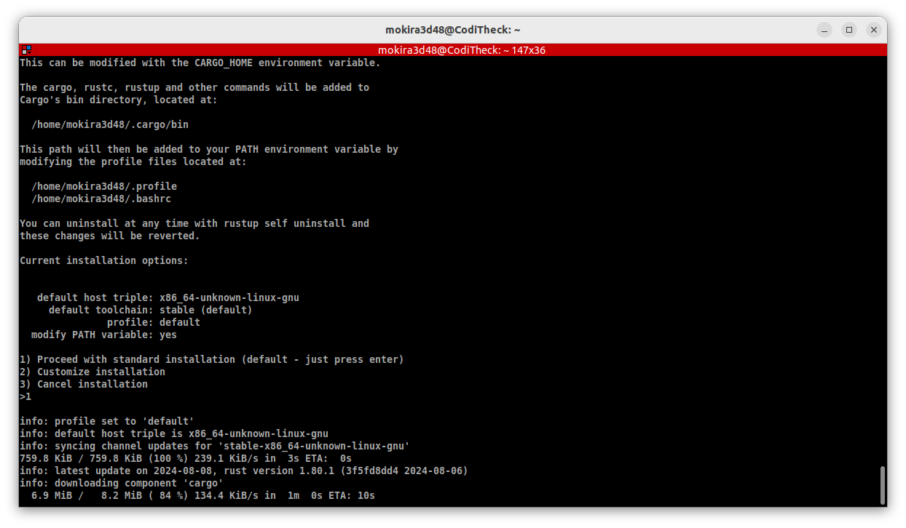

# Introduction
Rust est un langage compilé de programmation système. Il a trois objectifs
la rapidité, la sécurité (en mémoire) et concurrent (partage des données
sécurisées entre tâches). Le rust est notamment utilisé
pour :

- la programmation système;
- la programmation des serveurs webs;
- la programmation des applications en ligne de commandes (CLI);
- la programmation des applications graphiques;
- et des jeux-vidéos.

Le développement de Rust a été initié par *Graydon Hoare* en *2006*, notamment
dans le but de résoudre les failles de sécurité dans Firefox sans que cela
n'impacte négativement les performances. Sa première version stable, la 1.0,
est sortie le 15 Mai 2015. En Août 2020, Mozilla a arrêté de soutenir
le développement du langage, conduisant à la création de la fondation Rust
le 8 Février 2021. Le but de cette fondation n'étant pas de diriger
le développement du langage mais de le soutenir financièrement.

Depuis sa première version stable, Rust a été adopté par toutes les plus
grosses entreprises de l'informatique telle que Google qui s'en sert
pour Android ainsi que son cloud, Microsoft qui s'en sert
dans *Windows*, *Amazon*, *Facebook*, *Discord*, *Huawei*, *Dropbox*, *Mozilla*
...

Du côté des projets opensource, c'est devenu le troisième langage
de programmation utilisé dans le développement du kernel Linux après le C
et l'assembleur en 2022. Le projet GNOME a de plus en plus de projets
internes utilisant Rust et a déjà réécrit certaines de ses bibliothèques
telles que libsvg.

Les points forts de Rust sont :

- La gestion de "propriété" (ownership) des variables;
- La gestion de la mémoire;
- Le typage statique;
- L'inférence de type;
- Le filtrage par motif (pattern matching);
- La généricité.

Nous verrons tout cela en détails dans les chapitres qui suivent.
Pour le moment, voici quelques liens utiles :


- Le site internet : [rust-lang.org](http://www.rust-lang.org/)
- La [documentation](http://doc.rust-lang.org/stable/std/)
(toujours utile d'avoir ça sous la main !)
- Le dépôt [Github](https://github.com/rust-lang/rust)
(pour voir le code source)
- Le [rustbook](https://doc.rust-lang.org/stable/book/) (le "cours" officiel,
en anglais)
- Les [rustlings](https://github.com/rust-lang/rustlings/) (un programme
d'exercices intéractifs pour accompagner son apprentissage)
- [rust by example](https://doc.rust-lang.org/stable/rust-by-example/)
(Une compilation d'exemples de rust)
- Le [reddit](http://www.reddit.com/r/rust) (pour poser une question)

Commençons !

## Installation des outils
Pour pouvoir développer en Rust, il faut les bons outils.
Pour écrire le code, on peut utiliser soit :

- [l'éditeur de code Rust en ligne](https://play.rust-lang.org/);
- Soit un éditeur de code hors ligne, comme par exemple : visual studio avec
l'[extension Rust](https://marketplace.visualstudio.com/items?itemName=dos-cafe.Rust)
installée.


Concernant le compilateur Rust, l'installeur officiel
est disponible sur [rustup.rs](https://rustup.rs). Mais avant d'aller
sur ce dernier, tu dois exécuter la commande suivante afin d'installer
les outils nécessaires à l'installation des outils de Rust sur ton ordinateur.

```sh
sudo apt install build-essential curl
```

Tu peux ensuite exécuter la commande qui se trouve sur le site. Cette commande
te permettras d'installer automatiquement :

- le compilateur (rustc) installé;
- le gestionnaire de paquet (cargo) installé;
- la documentation du langage;
- ainsi que rustup qui te permettra de mettre
tout cela à jour facilement.

> L'exécution de la commande d'installation te proposera logiquement trois (03)
options. Si tu débutes, alors je te recommande de choisir l'option `1`,
pour procéder à une installation standard.

<div align="center">



</div>

Si après quelques temps, tu optiens le message d'erreur suivant à l'écran,
alors reexécute la même commande.

```
error: could not download file from 'https://static.rust-lang.org/dist/channel-rust-stable.toml.sha256' to '/home/mokira3d48/.rustup/tmp/9ck7n18hlu1k21np_file': failed to make network request: error sending request for url (https://static.rust-lang.org/dist/channel-rust-stable.toml.sha256): operation timed out
```

## Compilation
Si l'installation s'est bien passé, alors on peut commencer à écrire
notre premier programme en Rust dans un fichier nommé `hello.rs`.

```rust
fn main() {
    println!("Hello world!");
}
```

Pour compiler le code du fichier `hello.rs`, nous allons exécuter
la commande suivante :

```sh
rustc hello.rs
```

Cette commande va générer un fichier binaire exécutable ayant le même nom
que le fichier source. Pour exécuter ce binaire, il suffira d'exécuter :

```sh
./hello
```

Au cas où tu souhaite modifier le nom du fichier binaire à la compilation,
tu peux rajouter l'option `-o` suivie du nom que tu souhaites donner
au fichier.

```sh
rustc hello.rs -o mon_premier_programme
```

Et donc, tu feras comme suite pour l'exécuter :

```sh
./mon_premier_programme
```

Maintenant, tu sais comment compiler et exécuter tes programmes en Rust.


