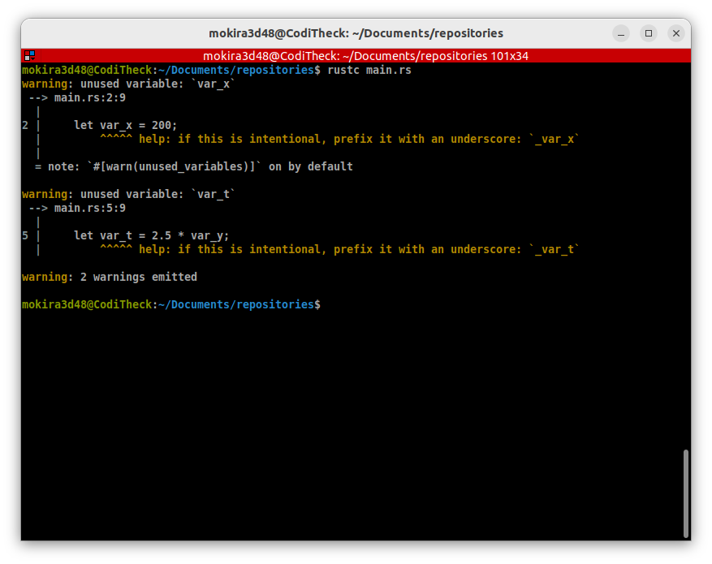

# Les variables
Pour créer une variable en Rust, il faut taper le mot-clé `let` suivi du nom
de la variable. La première chose à savoir en Rust est que toutes les variables
sont concidérée comme des constantes par défaut.

```rust
let i = 0;
i = 2; // donne une erreur!
```

De ce fait, pour déclarer une variable mutable, il faut utiliser
le mot-clé `mut` :

```rust
let mut i = 0;
i = 2;  // Maintenant, ça marche !
```

## Les types de variable
Le compilateur rust utilise l'**inférence de type**. Cela signifie,
qu'il est capable de déterminer le type d'une variable en utilisant
sa valeur d'initialisation.

```rust
let i = 0;  // 0 est un entier, donc i est une variable de type entier;
let pi = 3.14; // 3.14 est un réel donc pi est un réel.
```

Mais, des fois, nous avons besoin de spécifier un type pour nos variables,
pour cela voici comment on définit un type à la déclaration d'une variable.

```rust
let i:i32 = 12;  // i est un entier 32 bits
let pi:f32 = 3.14; // pi est un réel flottant de taille 32 bits.

// Pareil pour une variable mutable :
let mut x:f32 = 0.0;
x = 1.2;
```

Une chose que tu dois retenir, à partir du moment où tu as spécifié le type
d'une variable, elle ne peut plus contenir une valeur de type différent.

```rust
let mut x:u32 = 2000;
x = 3.23 // Donnera une erreur !
```

Voici donc le tableau récapitulatif des types de bases en Rust :

| Type    | Description                    |
|---------|--------------------------------|
| `i8`    | Entier 8 bits signé.           |
| `i16`   | Entier 16 bits signé.          |
| `i32`   | Entier 32 bits signé.          |
| `i64`   | Entier 64 bits signé.          |
| `u8`    | Entier 8 bits non-signé.       |
| `u16`   | Entier 16 bits non-signé       |
| `u32`   | Entier 32 bits non-signé       |
| `u64`   | Entier 64 bits non-signé       |
| `f32`   | Réel floattant 32 bits         |
| `f64`   | Réel floattant 64 bits         |
| `str`   | Chaîne de caractères.          |


Des fois, cela arrive qu'on déclare une variable qu'on n'utilise pas
dans le programme. Dans ce cas, le compilateur Rust, affiche un *Warning*
à la compilation, lorsque certaines variables sont déclarées 
mais n'ont plus été utilisées.

Par exemple si on tente de compiler le boût de code suivant :

```rust
fn main() {
    let var_x = 200;
    let var_y = 10.89;

    let var_t = 2.5 * var_y;
}
```

On obtient le warning suivant :

<div align="center">



</div>

> Les messages d'avertissement (warning) obtenus à la compilation, n'empêchent
pas la compilation d'un programme en Rust.

Dans le boût de code ci-dessus, les variables `var_x` et `var_t` n'ont pas
été utilisées, par contre la variable `var_y` a été utilisée pour initialiser
la variable `var_t`. C'est pour cela, il n'y a eu aucun avertissement
concernant `var_y`.

Pour éviter ce type d'avertissement à la compilation, on peut faire commencer
le nom des variables inutilisables par un underscore (`_`).

```rust
fn main() {
    let _var_x = 200;
    let var_y = 10.89;

    let _var_t = 2.5 * var_y;
}
```


